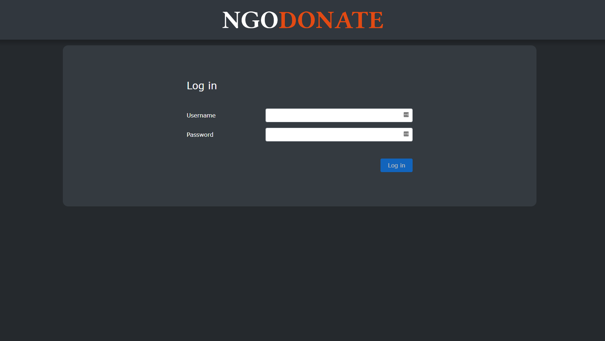

# NGODonate
This is a web portal designed to accomodate fundraising for non-profit organizations across the world. Users can view the fundrasing events and contribute to them as they please.
## Functional Specification
We implemented two user variants, base users and admin users. 
Base users can add their personal information and contribute monetary gifts towards varying causes. 
Admin users have access to everything base users have access to. In addition, they may create new users, view the log of donations, and manage the donation events.
## Screenshots

## Process
### Design
Workflow was organized prior to development with the development of a SRS diagram and user story spreadsheet. The spreadsheet kept track of what needed to be accomplished and what stages of development each component was at.
### Built with
* Semantic HTML5 markup
* [Bootstrap](https://getbootstrap.com/) - front-end framework
* [Angular](https://angular.io/) - web application framework
* [Typescript](https://www.typescriptlang.org/) - programming language, compiles to Javascript
## Authors 
[Logan Rennick](https://github.com/loganrennick)
[Usha Bommasamudram](https://github.com/ushadhir)
